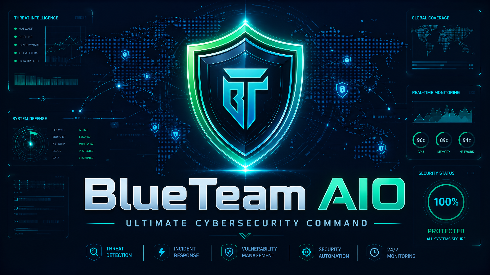

# By🇭🇷PhonkAlphabet

# 🛡️ BlueTeam AIO v1.3.0 - Ultimate Cybersecurity Command

BlueTeam AIO is a world-class, production-grade cybersecurity platform. It is the most comprehensive "All-In-One" solution for Linux security, featuring **26 specialized modules** that cover everything from kernel-level monitoring to AI-driven autonomous defense.

---

## 🧩 The 26-Module Architecture

BlueTeam AIO is built on a modular architecture where each component specializes in a specific domain of cybersecurity.

### 1. Core Runtime & Kernel Defense
1.  **Kernel Security (eBPF)**: Real-time monitoring of syscalls, rootkit detection, and LSM hooks.
2.  **Memory Forensics**: Live triage, process injection detection, and memory anomaly analysis.
3.  **Network Defense**: C2 detection, ARP spoofing protection, and DNS tunneling monitoring.
4.  **FIM & Anti-Ransomware**: Behavioral ransomware detection and File Integrity Monitoring.
5.  **EDR Core**: Process tree analysis, Sigma rules integration, and MITRE ATT&CK mapping.
6.  **SIEM Core**: Unified log collection (journalctl, auditd) and event correlation.

### 2. Advanced Security Operations
7.  **Vulnerability Scanner**: Automated scanning for Kernel/Package CVEs and CIS benchmarks.
8.  **IR Orchestration**: Incident Response playbooks and automated chain of custody.
9.  **Malware Sandbox**: Safe ELF analysis, behavioral strace, and YARA-style scanning.
10. **Hardening Module**: Automated sysctl hardening and AppArmor/SELinux enforcement.
11. **Cloud & Container Security**: Docker/Kubernetes scanning and IaC vulnerability detection.
12. **Reporting & Compliance**: Generation of professional security and audit reports.

### 3. Intelligence & Autonomous Defense
13. **AI/GGUF Engine**: Multi-agent AI orchestration for predictive threat scoring.
14. **Auto-Updater**: Automated updates for detection rules and module definitions.
15. **Forensic Hashing**: Cryptographic evidence integrity and blockchain-style hashing.
16. **RBAC Management**: Granular Role-Based Access Control for platform users.
17. **Stealth Mode**: Advanced evasion techniques for sensitive security operations.
18. **P2P Mesh Intelligence**: Global gossip protocol for real-time, decentralized IOC sharing.
19. **Purple Team Simulation**: Breach and Attack Simulation (BAS) for proactive testing.

### 4. Next-Gen Governance & Response
20. **SBOM Monitor**: Real-time Software Bill of Materials and dependency tracking.
21. **Self-Healing**: Automated system recovery and immutable rollback (Btrfs/ZFS).
22. **Metrics (Prometheus)**: Real-time performance and security metrics exporter.
23. **TIP Integration**: Automated ingestion of external threat intel (MISP, VirusTotal).
24. **SOAR Orchestrator**: Automated multi-step response playbooks (Ransomware, C2).
25. **Compliance Audit**: Real-time auditing for PCI-DSS, HIPAA, and GDPR standards.
26. **YARA Scanner**: Advanced filesystem-wide malware signature scanning.

---

## 🚀 Deployment & Installation

BlueTeam AIO is designed for easy deployment across any Linux environment.

### 📦 Installation Methods
- **Universal Script**: `sudo ./install.sh` (Supports Ubuntu, Debian, Fedora, RHEL, Arch)
- **Debian Package**: `sudo dpkg -i dist/blueteam-aio-1.3.0-amd64.deb`
- **Containerized**: `docker-compose up -d`
- **Cloud Native**: `kubectl apply -f k8s-deployment.yaml`

---

## 🖥️ User Interfaces

- **Futuristic WebUI**: A modern, glassmorphism-styled dashboard with 3D topology and real-time metrics.
- **Terminal UI (TUI)**: A robust, interactive terminal interface for low-resource environments.
- **REST API**: A full-featured FastAPI server with 26+ endpoints for integration.

---

## ⚖️ License
This project is licensed under the MIT License.

---
**Developed By🇭🇷PhonkAlphabet**
